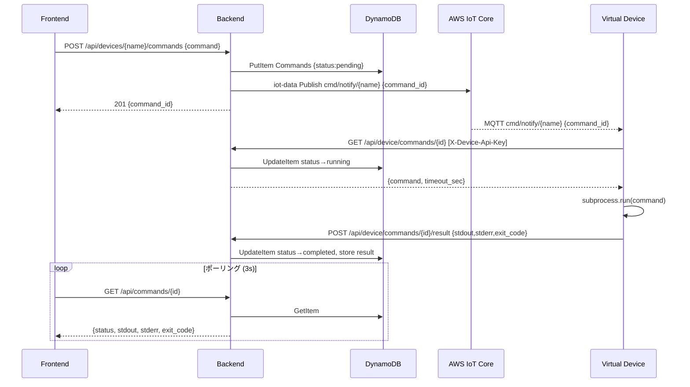
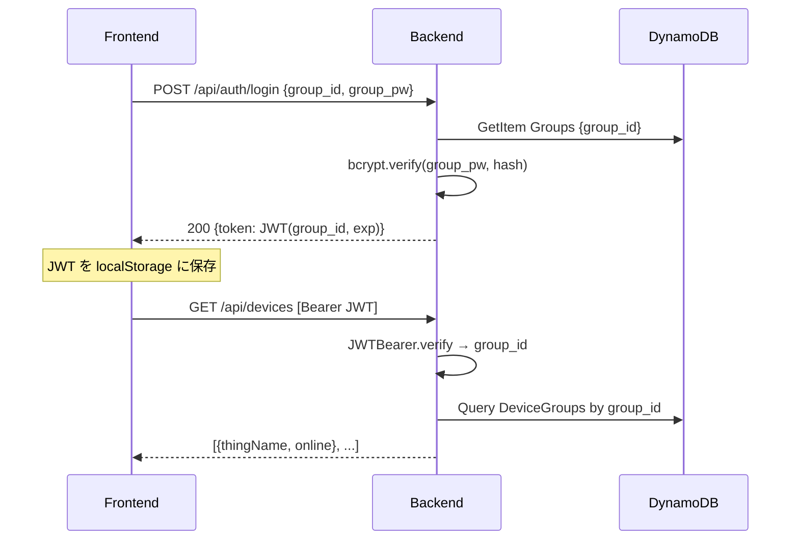

# Design Document

## Overview

本機能は既存の device-management デモに **マルチテナント認証**・**任意コマンド REST 実行** の 2 つの機能レイヤを追加する。

**Purpose**: テナント (グループ) 単位で装置を分離し、フロントから任意コマンドを投入して大きな実行結果を取得できるようにする。

**Users**: テナントユーザー (フロントエンド操作)、仮想装置 (コマンドエージェント)、管理者 (グループ/装置 seeding)。

**Impact**: 既存 Shadow 制御フローはそのまま残す。新機能は認証ミドルウェアと新エンドポイント群として追加するだけで、既存コードの変更は最小限に抑える。

### Goals

- JWT によるグループ認証でテナント間の装置アクセスを分離する
- MQTT はオンライン保持とコマンド着信通知 (command_id のみ) に限定し、コマンド本体・結果は HTTPS REST で転送する
- DynamoDB を永続化バックエンドとして追加し、ローカルでは Floci で代替する (IoT Core は実 AWS を継続使用)

### Non-Goals

- グループ間の装置移動 UI
- テナント内ロール分離 (RBAC)
- コマンド結果の長期ストレージ (S3 等)
- 既存 Shadow ベース制御 (enable/disable) の廃止

---

## Boundary Commitments

### This Spec Owns

- DynamoDB テーブル設計 (Groups / DeviceGroups / Commands)
- JWT 発行・検証ミドルウェア
- 新 REST エンドポイント (auth / commands / device-agent / admin)
- 装置側コマンドエージェントロジック (`command_runner.py`)
- Floci ローカル環境セットアップ (`make dev-local` / `seed-local`)

### Out of Boundary

- 既存 Shadow エンドポイント (`/api/devices/{name}/shadow`, enable/disable) の動作変更
- AWS IoT Core の Thing/Cert/Policy セットアップ (既存 `setup_aws_iot.sh` が担当)
- フロントエンドのビジュアルデザイン

### Allowed Dependencies

- 実 AWS IoT Core (MQTT ブローカー・コマンド通知の publish)
- Floci `http://localhost:4566` (DynamoDB ローカル代替)
- 既存 `iot_client.py` (Thing 一覧・Shadow 操作)

---

## Architecture

### Architecture Pattern & Boundary Map

```mermaid
flowchart TD
    subgraph Frontend["Frontend (React :5173)"]
        UI["UI\n(LoginForm / DeviceList\n/ CommandPanel)"]
    end

    subgraph Backend["Backend (FastAPI :9001)"]
        AUTH["auth router\nJWT 発行"]
        DEV["devices router\n(既存+テナントフィルタ)"]
        CMD["commands router\n(ユーザー向け)"]
        AGT["device_agent router\n(装置向け)"]
        ADM["admin router\n(seed 用)"]
        MW["JWTBearer\nmiddleware"]
    end

    subgraph Store["Persistence"]
        DDB["DynamoDB\n(Floci or AWS)"]
    end

    subgraph IoT["AWS IoT Core (実環境)"]
        SHADOW["Shadow"]
        MQTT["MQTT Broker"]
    end

    subgraph Device["Virtual Device (Python)"]
        AGENT["command_runner.py"]
        MQTTC["MQTT client"]
    end

    UI -->|POST /api/auth/login| AUTH
    UI -->|Bearer JWT| MW
    MW --> DEV & CMD
    AUTH --> DDB
    DEV --> DDB & IoT
    CMD --> DDB
    CMD -->|publish cmd/notify/{name}| IoT
    AGT --> DDB

    MQTTC -->|subscribe cmd/notify/{name}| MQTT
    MQTTC -->|Shadow delta| SHADOW
    AGENT -->|GET /api/device/commands/{id}| AGT
    AGENT -->|POST /api/device/commands/{id}/result| AGT
```

**選択パターン**: Layered REST + MQTT hybrid。  
MQTT は IoT Core 経由の常時接続・通知のみ、データ転送は HTTPS に統一。テナント認証は FastAPI `Depends` による JWT ミドルウェアで横断的に適用。

### Technology Stack

| Layer | Choice | Role | Notes |
|-------|--------|------|-------|
| Frontend | React + Vite + TypeScript | UI | 既存継続 |
| Backend | FastAPI + Mangum | REST API / Lambda | 既存継続。Router 追加 |
| Auth | PyJWT + passlib[bcrypt] | JWT 発行・PW ハッシュ | 新規追加 |
| DB Client | boto3 DynamoDB | 永続化 | 新規追加。`endpoint_url` で Floci 切替 |
| MQTT Client | awscrt (装置側) / boto3 iot-data (通知 publish) | 常時接続・通知 | 既存継続。IoT Core は実 AWS |
| Local Emulator | Floci (Docker) | DynamoDB ローカル代替 | `http://localhost:4566` |
| Subprocess | Python `subprocess` | コマンド実行 | タイムアウト制御付き |

---

## File Structure Plan

### Directory Structure

```
backend/app/
├── main.py                  # 既存。新 Router を include_router で追加
├── auth.py                  # JWT 発行・検証・JWTBearer Depends ← NEW
├── db.py                    # DynamoDB boto3 クライアント (endpoint_url 切替) ← NEW
├── iot_client.py            # 既存。mqtt_publish() を追加
├── routers/
│   ├── __init__.py
│   ├── auth.py              # POST /api/auth/login ← NEW
│   ├── devices.py           # GET /api/devices (テナントフィルタ) ← NEW (既存ルートを移動)
│   ├── commands.py          # POST /api/devices/{n}/commands, GET /api/commands/{id} ← NEW
│   ├── device_agent.py      # GET/POST /api/device/commands/{id} ← NEW
│   └── admin.py             # POST /api/admin/groups[/{id}/devices] ← NEW
└── models.py                # Pydantic モデル一覧 ← NEW

device/
├── virtual_device.py        # 既存。MQTT cmd/notify 購読を追加
├── command_runner.py        # コマンド実行エージェント ← NEW
└── config.json              # 既存。backend_url / api_key フィールドを追加

frontend/src/
├── App.tsx                  # ログイン状態管理・ルーティング追加
├── api.ts                   # auth / commands API 追加
├── types.ts                 # Group / Command 型追加
└── components/
    ├── LoginForm.tsx         ← NEW
    ├── CommandPanel.tsx      ← NEW
    └── CommandResult.tsx     ← NEW

scripts/
├── setup-floci.sh           # DynamoDB テーブル作成 ← NEW
└── seed-local.sh            # dev-group / virtual-device-01 seeding ← NEW

Makefile                     # dev-local / stop-local / seed-local ターゲット追加
```

### Modified Files

- `backend/app/main.py` — 新 Router 5 本を include_router で追加。`/api/devices` を `devices` router へ移動
- `device/virtual_device.py` — `cmd/notify/{thing_name}` 購読追加。`command_runner.py` を呼び出す
- `device/setup_aws_iot.sh` — IoT Policy に `cmd/notify/*` トピックの Subscribe/Receive を追加
- `frontend/src/App.tsx` — 認証状態 (JWT) 管理、ログイン未認証時は LoginForm 表示
- `frontend/src/api.ts` — `Authorization` ヘッダ自動付与、auth/commands エンドポイント追加
- `Makefile` — ローカル環境ターゲット追加

---

## System Flows

### コマンド実行フロー



### 認証フロー



---

## Data Models

### DynamoDB テーブル設計

#### Groups テーブル

| 属性 | 型 | 役割 |
|------|-----|------|
| `group_id` (PK) | S | テナント識別子 |
| `group_pw_hash` | S | bcrypt ハッシュ |
| `created_at` | S | ISO 8601 |

#### DeviceGroups テーブル

| 属性 | 型 | 役割 |
|------|-----|------|
| `thing_name` (PK) | S | 装置識別子 |
| `group_id` | S | 所属グループ (GSI の PK) |
| `api_key` | S | 装置 REST 認証キー (UUID) |
| `created_at` | S | ISO 8601 |

- **GSI**: `group_id-index` (PK=`group_id`) — テナント別装置一覧で使用

#### Commands テーブル

| 属性 | 型 | 役割 |
|------|-----|------|
| `command_id` (PK) | S | UUID v4 |
| `group_id` | S | 認可チェック用 |
| `thing_name` | S | 対象装置 |
| `command` | S | 実行コマンド文字列 |
| `status` | S | `pending` / `running` / `completed` / `failed` |
| `stdout` | S | 実行結果 (最大 10MB) |
| `stderr` | S | エラー出力 |
| `exit_code` | N | 終了コード |
| `duration_ms` | N | 実行時間 |
| `created_at` | S | ISO 8601 |
| `updated_at` | S | ISO 8601 |
| `ttl` | N | Unix 秒。7 日後に自動削除 |

- **GSI**: `thing_name-created-index` (PK=`thing_name`, SK=`created_at`) — 装置別コマンド履歴

---

## Components and Interfaces

### Backend

#### `auth.py` — JWT ミドルウェア

| Field | Detail |
|-------|--------|
| Intent | JWT 発行 (login) と FastAPI Depends による検証 |
| Requirements | 2.1–2.4 |

**API Contract**

| Method | Endpoint | Request | Response | Errors |
|--------|----------|---------|----------|--------|
| POST | /api/auth/login | `{group_id, group_pw}` | `{token}` | 401 |

```python
class JWTBearer(HTTPBearer):
    async def __call__(self, request: Request) -> str:
        """検証済み group_id を返す。失敗時は 401"""
```

#### `routers/commands.py` — コマンド管理 (ユーザー向け)

| Method | Endpoint | Auth | Request | Response | Errors |
|--------|----------|------|---------|----------|--------|
| POST | /api/devices/{name}/commands | JWT | `{command}` | `{command_id}` 201 | 403, 404 |
| GET | /api/commands/{id} | JWT | — | Command item | 403, 404 |
| GET | /api/devices/{name}/commands | JWT | — | Command list | 403 |

- `POST` 後に IoT Data `publish` で `cmd/notify/{thing_name}` に `{command_id}` を送信する

#### `routers/device_agent.py` — コマンド管理 (装置向け)

| Method | Endpoint | Auth | Request | Response | Errors |
|--------|----------|------|---------|----------|--------|
| GET | /api/device/commands/{id} | X-Device-Api-Key | — | `{command, timeout_sec}` | 401, 404 |
| POST | /api/device/commands/{id}/result | X-Device-Api-Key | `{stdout, stderr, exit_code, duration_ms}` | 200 | 401, 404, 409 |

- `X-Device-Api-Key` を DynamoDB `DeviceGroups.api_key` と照合して認証する

#### `db.py` — DynamoDB クライアント

```python
import os, boto3
from functools import lru_cache

ENDPOINT = os.environ.get("LOCALSTACK_ENDPOINT")  # None → 実 AWS

@lru_cache(maxsize=1)
def ddb():
    return boto3.resource("dynamodb", endpoint_url=ENDPOINT)
```

### Device

#### `command_runner.py` — コマンド実行エージェント

```python
def run_command(command: str, timeout_sec: int) -> dict:
    """subprocess で実行。stdout/stderr/exit_code/duration_ms を返す"""

def fetch_and_execute(command_id: str, backend_url: str, api_key: str) -> None:
    """GET コマンド → 実行 → POST 結果 のフルサイクル"""
```

- `virtual_device.py` の `_on_command_notify` コールバックから呼び出す
- 同時実行数は 1 (次の通知は前の実行完了まで待つ。threading.Lock)

### Frontend

#### `LoginForm.tsx`

- `group_id` / `group_pw` フォーム → `POST /api/auth/login` → JWT を `localStorage` 保存
- 認証失敗時はエラーメッセージ表示

#### `CommandPanel.tsx`

- コマンド入力 textarea + 実行ボタン → `POST /api/devices/{name}/commands`
- `CommandResult` コンポーネントで結果をポーリング表示

---

## Error Handling

| カテゴリ | 条件 | レスポンス |
|----------|------|------------|
| 認証失敗 | PW 不一致 / トークン期限切れ / 不正 | 401 |
| 認可失敗 | 他テナントの装置/コマンドへのアクセス | 403 |
| Not Found | 存在しない command_id / thing_name | 404 |
| 競合 | result を二重 POST | 409 |
| タイムアウト | コマンド実行が COMMAND_TIMEOUT_SEC 超過 | status=`failed`, exit_code=-1 |
| IoT publish 失敗 | コマンド登録時の MQTT 通知失敗 | 202 (コマンドは保存済み)。装置は再起動時に pending を検索してもよい |

---

## Testing Strategy

- **Unit**: JWT 発行/検証、bcrypt 検証、`run_command` タイムアウト動作
- **Integration (Floci)**: DynamoDB CRUD (Groups/DeviceGroups/Commands)、コマンド登録→結果更新フロー
- **E2E (手動)**: `make dev-local` 起動 → ブラウザでログイン → コマンド実行 → 結果表示

---

## Security Considerations

- `group_pw` は bcrypt (work factor 12) でハッシュ化。平文は DB に入れない
- JWT 署名鍵は `JWT_SECRET` 環境変数で注入。デフォルト値は開発専用文字列のみ許可
- `X-Device-Api-Key` はグループ管理者が `POST /api/admin/groups/{id}/devices` 時に自動生成 (UUID v4) する
- コマンド実行は装置プロセスの権限内に閉じる。将来的な Docker サンドボックス化は Non-Goal
- IoT Policy に `cmd/notify/{thing_name}` トピックの Subscribe/Receive を追加 (`setup_aws_iot.sh` 更新)
